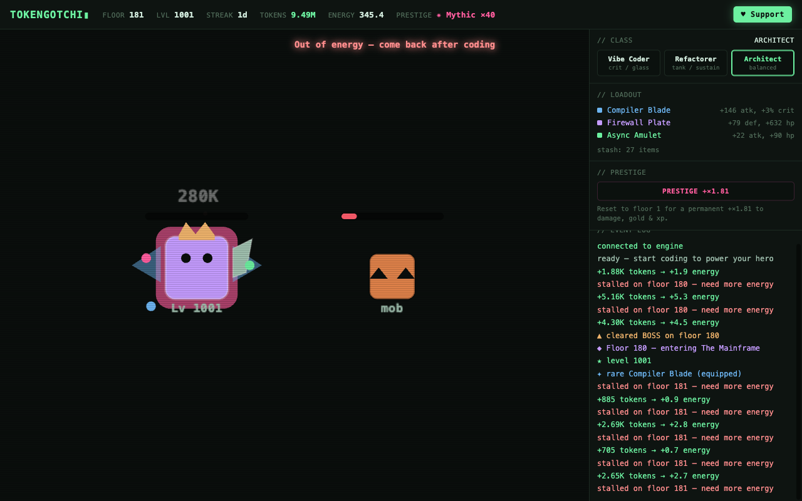

# Tokengotchi

**An idle RPG that runs on your AI coding tokens.** You code; a little hero spends the
energy fighting through floors, leveling up, and finding loot. Come back from a session
to see what it cleared while you were heads-down.



```bash
npx tokengotchi
```

One command. It reads the usage your AI agent already writes to disk, turns it into
energy, and opens the game in your browser. Nothing leaves your machine.

**[Live demo & video »](https://danzinov.github.io/tokengotchi/)** · runs locally · free · no pay-to-win

## What it does

- Reads your local usage from **Claude Code, Codex, and Gemini** (Cursor is experimental) —
  the same logs `ccusage` reads.
- Turns tokens into combat energy and auto-battles an idle dungeon: floors, bosses, gold,
  XP, and gear drops.
- **Three classes** — Vibe Coder (crit), Refactorer (tank), Architect (balanced). Swap anytime.
- **Loot** from Common to Legendary, auto-equipped, with a hero that **visibly evolves** as
  it levels — gaining a weapon, an aura, wings, a crown, orbiting orbs.
- **Attack styles** unlock as you climb: melee → ranged → multi-shot → beam.
- **Prestige** ranks (Bronze → Mythic) for a permanent multiplier and the long climb,
  through themed zones with milestone rewards.
- A lot of code-driven "juice" — hit flashes, crits, knockback, damage numbers, particles,
  screen shake.

Opens as a chromeless app window by default (park it next to your editor), or install it as
a PWA. The UI is responsive down to a thin side strip.

## "Wait, doesn't this reward me for burning tokens?"

No — that was the main thing to get right. Rewards are **streak-weighted**, so showing up
consistently beats raw volume. It's **PvE only**, so you're racing floors, not anyone's
spend. And it's **free with no pay-to-win**. The point is to make the work you're already
doing a bit more fun, not to get you to spend more. (There's an optional sub-linear daily
taper you can switch on if you want it even stricter.)

## Options

```bash
npx tokengotchi              # real usage, opens in an app window
npx tokengotchi --mock       # fake usage, for a quick look
npx tokengotchi --tab        # a normal browser tab instead of an app window
npx tokengotchi --port=7070  # change the port
npx tokengotchi --no-open    # don't auto-open anything
npx tokengotchi --once       # one sync, print a summary, exit
```

Your save lives at `~/.tokengotchi/save.json`.

## How it works

Tokengotchi never calls a provider API. Your AI agent already writes token counts to local
log files as you work — it reads those, advances a cursor so it never double-counts,
converts the delta into energy, resolves a combat session, and replays it in a PixiJS view
over a local WebSocket.

| Tool | Reads from |
|---|---|
| Claude Code | `~/.claude/projects/**/*.jsonl` |
| Codex | `~/.codex/sessions/**/rollout-*.jsonl` |
| Gemini CLI | `~/.gemini/tmp/**/chats/*.{json,jsonl}` |
| Cursor | local `state.vscdb` — experimental; needs Node ≥22.5 or `npm i better-sqlite3` |

Adding another tool is one small adapter in `src/readers/`.

## Free & open

The whole game is free — no accounts, no telemetry, no paywall. If you want to chip in,
there's a Support button in the app (it never buys anything in-game):

- **Ko-fi** — https://ko-fi.com/danzin
- **Buy Me a Coffee** — https://buymeacoffee.com/danzin

## Development

```bash
git clone https://github.com/DanZinov/tokengotchi
cd tokengotchi
npm install
npm run demo        # build the client + run with mock usage
npm test            # unit tests (deterministic, seeded)
npm run typecheck
```

The game math — conversion, combat, loot, progression, prestige — lives in `src/engine/` as
pure, tested functions. Readers are in `src/readers/`, the CLI and local server in
`src/cli/`, and the PixiJS client in `src/client/`. Tuning lives in
`src/engine/constants.ts`. Everything is drawn from Pixi primitives, so it runs with zero
downloaded assets.

PRs welcome — new tool readers, balance tweaks, and art especially.

## License

MIT
